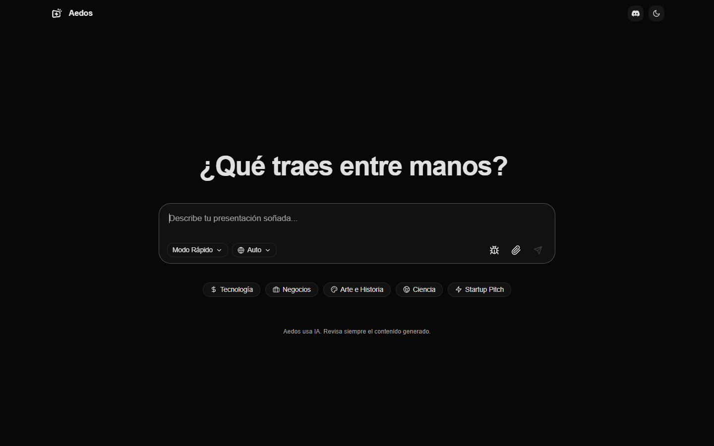
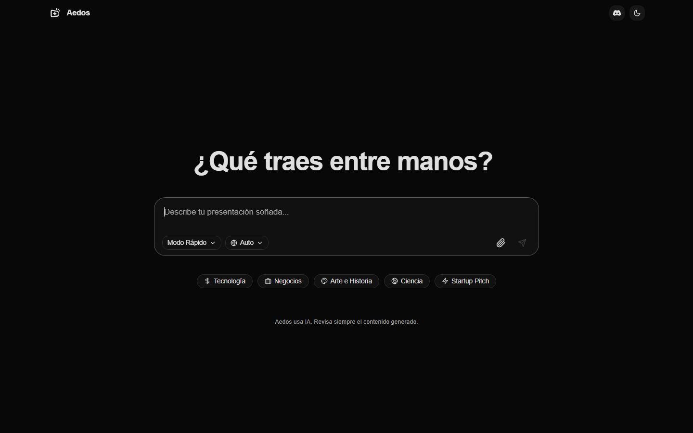
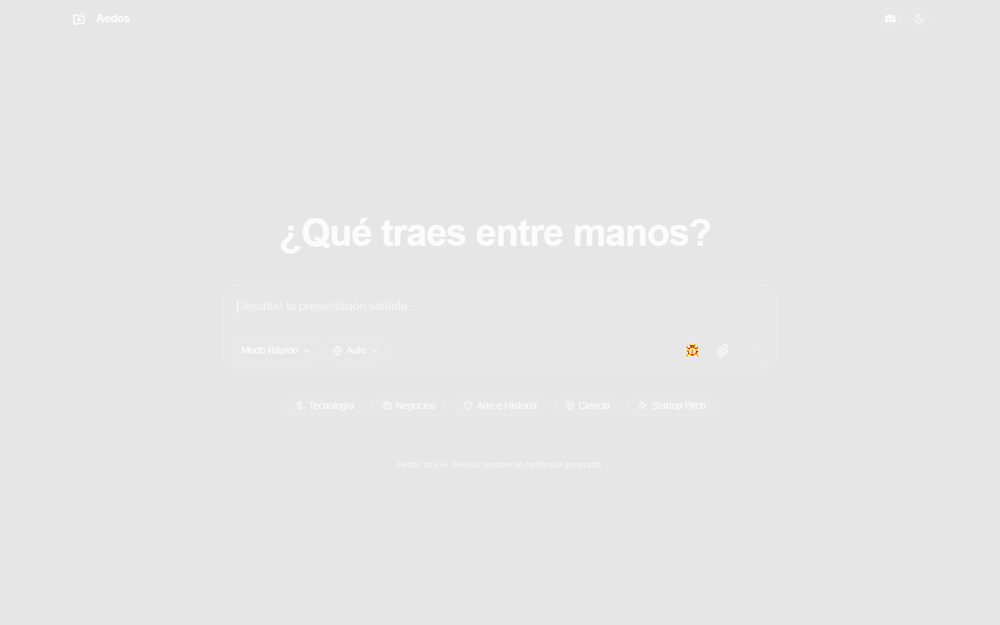

# Diagnóstico de la baseline visual

La reproducción se hizo en el worktree temporal `aedos-visual-diagnosis`, desde
`refactor/fase-3c-fix`, y el cambio se limitó a ese checkout temporal.

## Mutación del fondo de `body`

Se sustituyó temporalmente `body { background-color: var(--bg) }` por
`background-color: red`. En Chrome, `getComputedStyle(body).backgroundColor`
devolvió `rgb(255, 0, 0)`. Sin embargo, `#chat-screen` tenía rectángulo
`(0,0,1440,900)` y fondo opaco `rgb(8, 8, 8)`, cubriendo el viewport capturado.
La mutación de `body` no cambia ningún píxel visible y debe pasar el check.

## Qué significaban las 80 diferencias

En la reproducción con la baseline antigua, la comparación midió
`80/80/0/0` píxeles con threshold `0.1`. El diff los sitúa en el rectángulo
`x=989..1004, y=496..512` (16×17 px); no se distribuyen por el fondo. El
baseline guardado tenía el botón local `#btn-debug-last-generated`, mientras
que el endpoint `HEAD /__dev__/last-generated` del worktree limpio devolvió
404 y la captura actual no lo incluyó. Por tanto, el conteo era ruido de un
fixture de desarrollo dependiente de `tmp/last-generated.html`, no detección
del fondo rojo. No había máscaras en `visual-config.json`.

La comprobación complementaria de B.4 cambia el fondo de `#chat-screen`, que sí
se pinta en el viewport. Esa mutación produce una diferencia masiva y debe
fallar; el fondo rojo de `body`, cubierto por `#chat-screen`, queda marcado como
caso no visible y esperado en verde.
